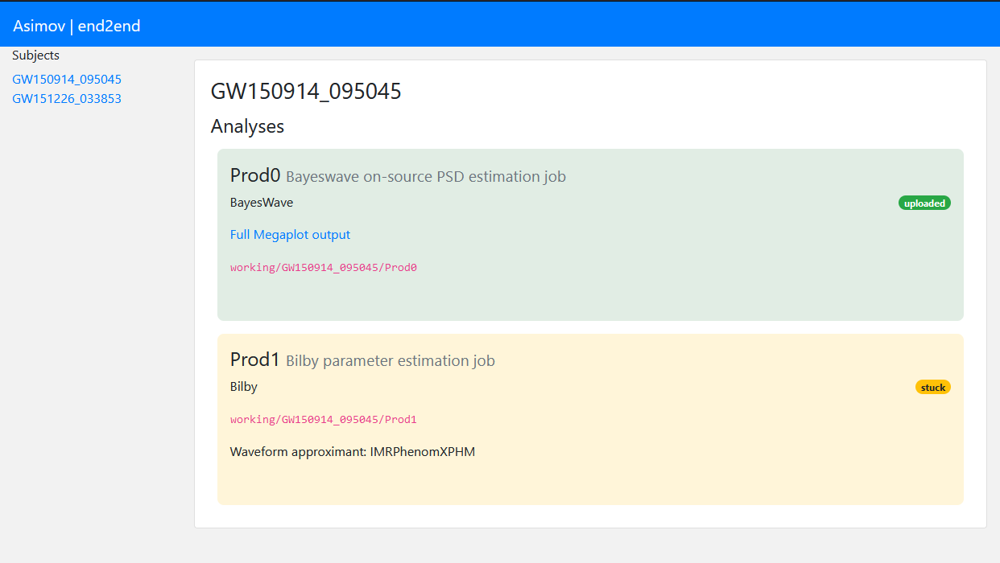

================
Progress reports
================

Most of the analyses which are run by asimov take a long period of time to run, and many of the jobs its designed to do involve setting up dozens or even hundreds of analyses.
While it is possible to use the command line to keep track of this, using the
::
   asimov monitor

command, it can be helpful to set things up so that analyses are checked reguarly and automatically, and so that all of the analyses and information about them can be seen in one place.

These problems can be solved by two features within asimov, its automatic monitoring tool, and its reporting tool.

This document will discuss the reporting tool in detail, but will also show how it can be used alongside the automatic monitoring tool to create a powerful insight to your asimov project.

Automatic analysis monitoring
-----------------------------

The tool asimov provides to check the status of all the analyses in a project is called ``asimov monitor``, and running this on the command line will produce a list of all of the analyses which are currently either running, or ready to start running, and give some brief information about them.

For example you might see something like this if you run in an asimov project where there's a running analysis:
::
   ❯ asimov monitor
   GW150914_095045
        - Prod1[bilby]
          ● Prod1 is running (condor id: 300807672)

Behind the scenes asimov checks with the condor scheduler on the system if the job's still running, and if it isn't then it checks to see if it's either completed, and then starts post-processing or moving the files to the results directory.
If the job hasn't finished then asimov will attempt to restart it if it can, or will report that it's "stuck".

Because the asimov monitor job is responsible for progressing an event through multiple analyses it is useful to run it reguarly, and asimov provides an automated tool to run it every 15 minutes.
Running ``asimov start`` will set up a "cron job" which runs on the ``htcondor`` cluster, and monitors the project every 15 minutes.
In addition to running ``asimov monitor``, this command also runs ``asimov manage build submit``, which will create and start new analyses, or analyses which are now able to run as their requirements are met (so for example a ``bilby`` job which depends on a Bayeswave job in order to produce its on-source PSDs will be started automatically once that Bayeswave job has completed).
Finally, the command runs ``asimov report html`` which will update the project summary page, showing a summary of the status of all of the runs in a web page.

Asimov summary pages
--------------------

The asimov summary pages which are produced by ``asimov report html`` show a list of all of the events and analyses in the project, and the status of those analyses.
If the pipeline supports it, it is also possible to access diagnostic plots and results from the summary pages.

An example of a summary page, for an event with a completed Bayeswave event but a "stuck" bilby event is shown in this screenshot:

Location of pages
~~~~~~~~~~~~~~~~~

By default the web pages produced by asimov are placed in the ``pages`` directory inside the project.
However, under normal circumstances theese won't be accessible via the web, which is especially important if you're trying to access them on a compute cluster.

The location of the pages can be changed in the configuration file for the project, which is called ``asimov.conf``.
The value
::
   [general]
   webroot = pages/

Can be changed to point instead to a directory which is served by a webserver.
For example, on an LDG cluster you can set
::
   [general]
   webroot = /home/albert.einstein/LVC/projects/my-asimov-project

In order to produce a summary page visible at
``https://ldas-jobs.ligo.caltech.edu/~albert.einstein/LVC/projects/my-asimov-project``

(after replacing ``albert.einstein`` with your own username).
