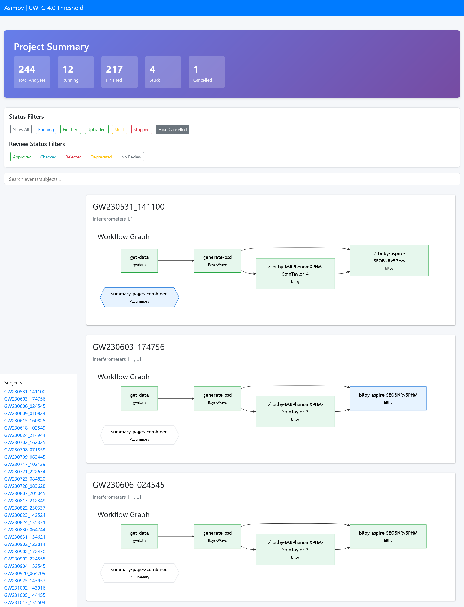
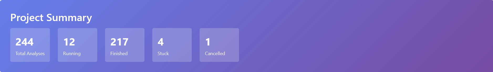
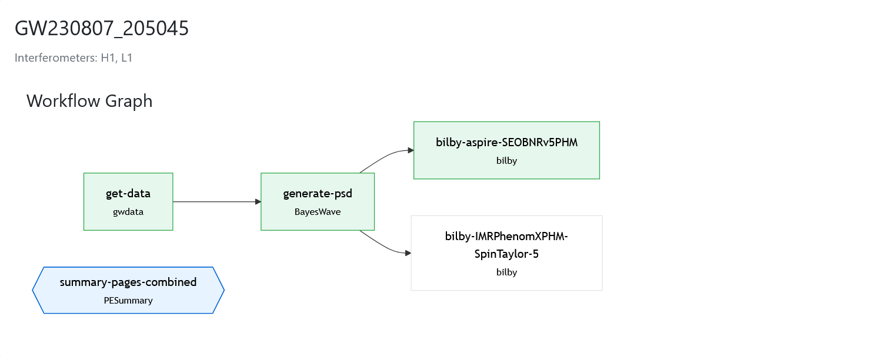
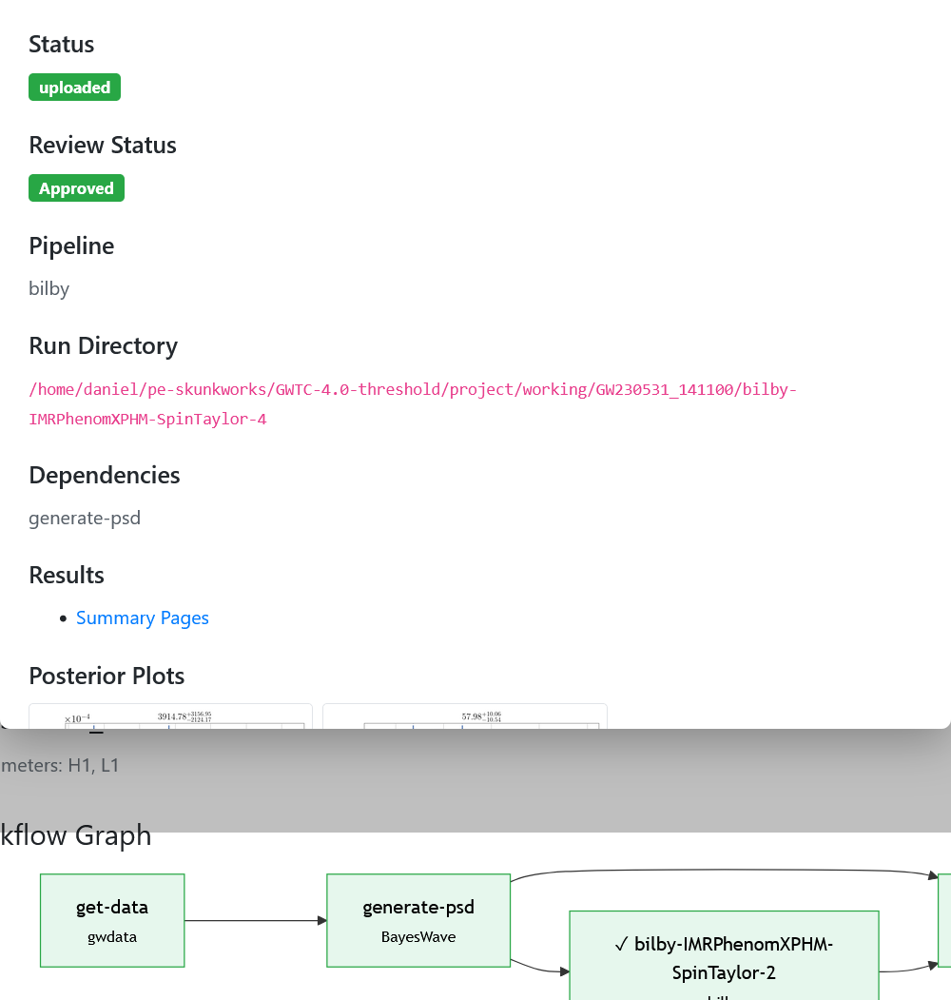

================
Progress reports
================

Most of the analyses which are run by asimov take a long period of time to run, and many of the jobs its designed to do involve setting up dozens or even hundreds of analyses.
While it is possible to use the command line to keep track of this using ``asimov monitor``, it can be helpful to set things up so that analyses are checked regularly and automatically, and so that all of the analyses and information about them can be seen in one place.

These problems can be solved by two features within asimov: its automatic monitoring tool, and its reporting tool.
This document will discuss the reporting tool in detail, and show how it can be used alongside the automatic monitoring tool.

Automatic analysis monitoring
-----------------------------

The tool asimov provides to check the status of all the analyses in a project is called ``asimov monitor``, and running this on the command line will produce a list of all of the analyses which are currently either running, or ready to start running, and give some brief information about them.

For example you might see something like this if you run in an asimov project where there's a running analysis:

.. code-block:: console

   $ asimov monitor
   GW150914_095045
        - Prod1[bilby]
          ● Prod1 is running (condor id: 300807672)

Behind the scenes asimov checks with the condor scheduler on the system if the job is still running, and if it isn't then it checks whether it has completed, and starts post-processing or moves the files to the results directory.
If the job hasn't finished then asimov will attempt to restart it if it can, or will report that it's "stuck".

Because the ``asimov monitor`` command is responsible for progressing an event through multiple analyses it is useful to run it regularly.
Running ``asimov start`` will set up a cron job which runs on the HTCondor cluster and monitors the project every 15 minutes.
In addition to running ``asimov monitor``, this command also runs ``asimov manage build submit``, which will create and start new analyses or analyses whose requirements have just been met.
Finally, the command runs ``asimov report html`` which will update the project summary page.

Generating the report
---------------------

The HTML report is generated by running

.. code-block:: console

   $ asimov report html

from inside the project directory, or by passing the project root explicitly:

.. code-block:: console

   $ asimov report html --event GW150914_095045

to restrict the report to a single event.

The report is a single self-contained HTML file together with a JavaScript bundle (``mermaid-elk.bundle.js``) placed alongside it.
Both files must remain in the same directory to be served correctly.

Location of pages
~~~~~~~~~~~~~~~~~

By default the web pages produced by asimov are placed in the ``pages`` directory inside the project.
However, under normal circumstances these will not be accessible via the web, which is especially important if you're trying to access them on a compute cluster.

The location of the pages can be changed in the project configuration file ``asimov.conf``:

.. code-block:: ini

   [general]
   webroot = pages/

Change this to point to a directory that is served by a web server.
For example, on an LDG cluster you can set

.. code-block:: ini

   [general]
   webroot = /home/albert.einstein/LVC/projects/my-asimov-project

to produce a summary page visible at
``https://ldas-jobs.ligo.caltech.edu/~albert.einstein/LVC/projects/my-asimov-project``
(after replacing ``albert.einstein`` with your own username).

Using the report
----------------

The report is an interactive single-page application.
It shows a summary dashboard at the top, a filter and search bar, and then one card per event listing all of its analyses.

Summary dashboard
~~~~~~~~~~~~~~~~~

The dashboard at the top of the page shows a live count of analyses by status: total, running, finished, stuck, and cancelled.
The counts update immediately when you apply a filter.

Filtering and search
~~~~~~~~~~~~~~~~~~~~

The filter bar lets you narrow the view in several ways:

**Status filters** (Running, Finished, Uploaded, Stuck, Stopped)
   Click one of these buttons to show *only* analyses with that status.
   Click the same button again, or click *Show All*, to reset.

**Hide Cancelled**
   This toggle is *on by default*.
   It hides all cancelled and stopped analyses, and also hides analyses whose review status is ``deprecated`` or ``rejected``.
   Click it to reveal them again.

**Review status filters** (Approved, Checked, Rejected, Deprecated, No Review)
   Click one of these to show only analyses with that review status.

**Search box**
   Type any part of an event name to hide all non-matching events.
   The filter is applied as you type.

All filters operate on the workflow graphs directly — the event card collapses and shows "(No visible analyses)" when every analysis it contains is hidden by the active filters.
The page also auto-refreshes every 15 minutes to pick up the latest state from a running ``asimov start`` cron job.

Workflow graphs
~~~~~~~~~~~~~~~

Each event card contains a workflow graph showing the analyses for that event and the dependencies between them.

Node shapes indicate the analysis type:

- **Rectangles** — regular pipeline analyses (bilby, BayesWave, LALInference, etc.)
- **Hexagons** — subject analyses that combine results from multiple pipelines (e.g. a combined PESummary run)

Node colours indicate the analysis status:

.. list-table::
   :header-rows: 1
   :widths: 20 80

   * - Colour
     - Status
   * - Green
     - Finished or uploaded
   * - Blue
     - Running or processing
   * - Amber
     - Stuck
   * - Light grey
     - Ready, waiting, or cancelled
   * - Red border
     - Stopped

A tick mark (✓) before the analysis name indicates an approved review; a cross (✗) indicates a rejected review.
The pipeline name is shown in smaller text below the analysis name.

Click any node to open the analysis detail modal (see below).

Analysis detail modal
~~~~~~~~~~~~~~~~~~~~~

Clicking a node in the workflow graph opens a modal panel showing details for that analysis.

The modal shows:

- **Status** — the current analysis status as a coloured badge
- **Review status** — the review outcome (Approved, Checked, Rejected, Deprecated, or No Review), together with any reviewer comment
- **Pipeline** — the pipeline used for this analysis
- **Comment** — any free-text comment stored in the ledger for this analysis
- **Run directory** — the on-disk path where the analysis ran
- **Waveform approximant** — the approximant recorded in the analysis metadata
- **Dependencies** — the names of analyses this one depended on
- **Results** — links to the PESummary summary pages, if available
- **Posterior plots** — inline 1D posterior plots fetched directly from the PESummary output directory, if available (see `Configuring inline plots`_ below)

The modal is dismissed by clicking the × button or clicking outside it.

Configuring inline plots
------------------------

By default, the modal shows 1D posterior plots for **luminosity distance** and **chirp mass** for any finished bilby analysis, and for each contributing analysis in a combined PESummary run.

The set of parameters shown can be overridden per-event by adding a ``report`` block to the event's entry in the ledger:

.. code-block:: yaml

   events:
     - name: GW150914_095045
       report:
         modal_plots:
           - chirp_mass
           - luminosity_distance
           - chi_eff
           - mass_ratio

The parameter names must match the suffixes used by PESummary when naming its 1D posterior plot files (e.g. the file ``bilby-run_1d_posterior_chi_eff.png`` corresponds to the parameter ``chi_eff``).

Plots are loaded directly from the PESummary output directory at
``{webroot}/{event}/{analysis}/pesummary/plots/``.
If a plot file does not yet exist (for example because PESummary has not yet run) the image slot is simply left empty — no error is shown.
